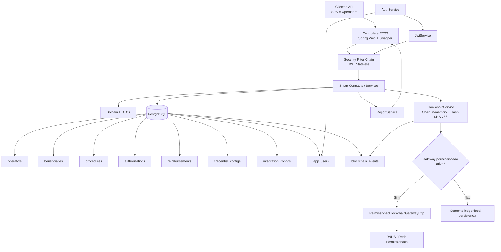

# Arquitetura Implementada

## Visao Geral

A implementacao segue arquitetura em camadas com API REST, servicos de negocio (smart contracts), persistencia PostgreSQL, seguranca JWT com RBAC e modulo de blockchain com opcao de publicacao para rede permissionada.

## Diagrama

## Pacotes Principais

- br.gov.sus.rndsressarcimento.controller
- br.gov.sus.rndsressarcimento.service
- br.gov.sus.rndsressarcimento.security
- br.gov.sus.rndsressarcimento.blockchain
- br.gov.sus.rndsressarcimento.persistence.entity
- br.gov.sus.rndsressarcimento.persistence.repository
- br.gov.sus.rndsressarcimento.domain
- br.gov.sus.rndsressarcimento.dto

## Regras de Acesso RBAC

- ROLE_SUS: acesso total, incluindo auditoria blockchain e relatorios SUS.
- ROLE_OPERADORA: acesso operacional a fluxo de negocio e configuracoes permitidas.

## Artefatos Gerados

- Collection Postman: postman/RNDS-Ressarcimento.postman_collection.json
- Environment Postman: postman/RNDS-Ressarcimento.postman_environment.json
